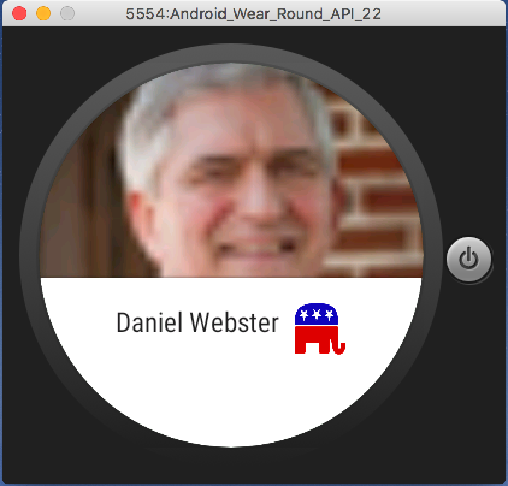
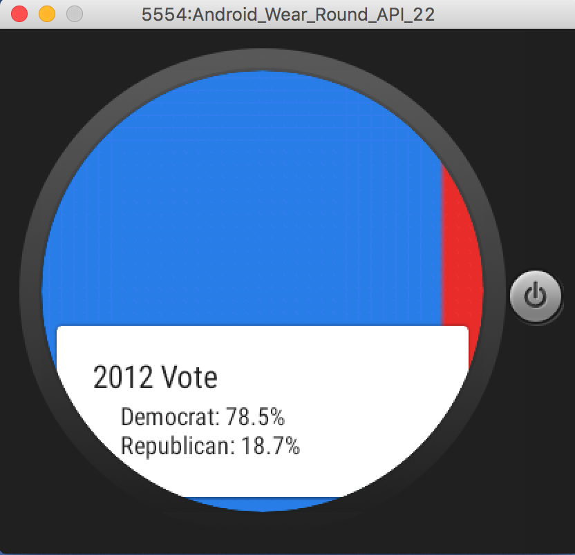

# PROG 02: Educated Voter!

This app is meant to Educate voters on their representatives. This will help people reach the right people with their issues.

It also helps people know if they are in a swing state. That way they know that their vote is very important.

## Authors

Pradeep Kalipatnapu ([prad@berkeley.edu](mailto:prad@berkeley.edu))

## Demo Video

See [demo video here] (https://youtu.be/ZX8cORBiVHM)

## UI Mocks

The UI mocks were done on Figma. You can find them [here] (https://www.figma.com/file/VbKT47YmKXLRkMJRfQYFNJ4h/Educated-Voter)

## Screenshots

## Acknowledgements
Exandable List View [turorial] (http://www.androidhive.info/2013/07/android-expandable-list-view-tutorial/) was very helpful.
I also used this [code] (http://stackoverflow.com/questions/11932805/cropping-circular-area-from-bitmap-in-android) for circular images from the square ones that twitter provided.
